# 🔥 GitHub Streak Counter

> **Github streak counter but cooler** — a self-hosted service that generates animated SVG stat cards for your GitHub profile README.

## Preview

<p align="center">
  
</p>

---

## Themes

Pick a color theme using the `color` query parameter. Preview of all available themes:

| Theme | Preview |
|---|---|
| `color=cyan` |  |
| `color=blue` |  |
| `color=ice` |  |
| `color=green` |  |
| `color=toxic` |  |
| `color=pink` |  |
| `color=magenta` |  |
| `color=purple` |  |
| `color=orange` |  |
| `color=gold` |  |
| `color=red` |  |
| `color=white` |  |

---

## Usage

### Use the hosted version

Simply paste this into your GitHub `README.md`:

```md

```

To use a specific color theme, add the `color` param:

```md

```

Replace `{your-username}` with your GitHub username and `{theme-name}` with one of the theme names from the table above. If `color` is omitted, the default theme is used.

**Examples:**

```md


```

### Self-host

#### Prerequisites

- Node.js 18+
- npm

#### Installation

```bash
git clone https://github.com/Prabin1025y/Github-Streak-Counter.git
cd Github-Streak-Counter
npm install
```

#### Configuration

Create a `.env` file in the root directory:

```env
PORT=3000
```

#### Run

```bash
node index.js
```

The server will start on `http://localhost:3000`.

#### Usage after self-hosting

```md


```

---

## Architecture

```
Github-Streak-Counter/
├── index.js          # Express server entry point
├── router/           # Route handlers
├── utils/            # SVG generation + GitHub scraper
│   ├── scraper.js    # Puppeteer scraping logic
│   └── svgGenerator.js  # Animated SVG string builder
├── public/
├── .env              # Environment config
└── package.json
```

---

## SVG Card Details

The generated card is a `668×420` SVG containing:

| Section | Content |
|---|---|
| Left | Contributions this year |
| Center | Animated 🔥 flame + current streak number |
| Right | Active days this year |
| Bottom bar | This week's daily contributions with streak highlighted |

---

## Limitations

- Only works for **public GitHub profiles**
- Data is scraped from GitHub's HTML — changes to GitHub's DOM structure may break scraping
- Response time on cache miss depends on GitHub page load speed (typically 2–5 seconds)

---

## Contributing

Pull requests are welcome. For major changes, please open an issue first.

1. Fork the repo
2. Create your feature branch (`git checkout -b feature/cool-thing`)
3. Commit your changes (`git commit -m 'Add cool thing'`)
4. Push to the branch (`git push origin feature/cool-thing`)
5. Open a Pull Request

---

## License

MIT

---

## Author

Made by [@Prabin1025y](https://github.com/Prabin1025y)